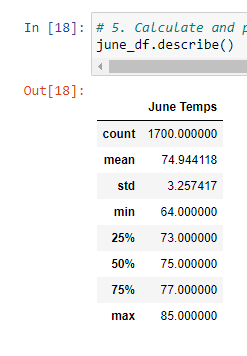
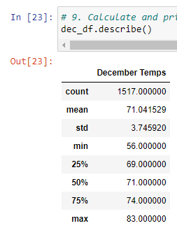

# Surfs Up - An Analysis of Hawaiian Temperatures and Building a Business
In this challenge, W. Avy wants to take our anaysis one step deeper. Using the data available, W. Avy wants the temperture statistics for the months of both June and December, to determine if the surf shop/ice cream shop is sustainable year-round. We will pull the data and organize it by min, max, average, etc. to give W. Avy an all-encompassing view of monthly temperature.

# The Results
From the available data, we were able to pull temperatures for both June and December, and used the .describe() funtion to display the following information:

